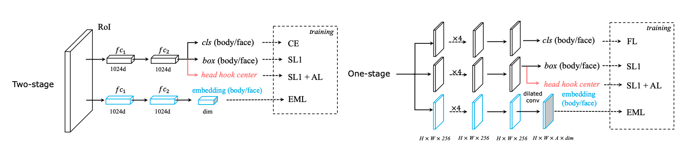

Body-Face Joint Detection via Embedding and Head Hook
===

This project (based on [CrowdDet](https://github.com/Purkialo/CrowdDet)) is the re-implementation of our paper "[*Body-Face Joint Detection via Embedding and Head Hook*](https://openaccess.thecvf.com/content/ICCV2021/papers/Wan_Body-Face_Joint_Detection_via_Embedding_and_Head_Hook_ICCV_2021_paper.pdf)" published in ICCV2021.

## Introduction

Our motivation is to detect the body and face of pedestrians in a joint manner, which is important in many industrial applications. The core ideas of our approach are mainly two-fold: 1). From appearance level, learning associative embeddings. 2). From geometry level, using adjuct head center as hooks ("head hook"). We utilize information from these two sources to match bodies and faces online inside the detector.




## Citations

If you find this work is useful in your research, please cite:
```bibtex
@inproceedings{wan2021body,
  title={Body-Face Joint Detection via Embedding and Head Hook},
  author={Wan, Junfeng and Deng, Jiangfan and Qiu, Xiaosong and Zhou, Feng},
  booktitle={Proceedings of the IEEE/CVF International Conference on Computer Vision},
  pages={2959--2968},
  year={2021}
}
```

## Data Preparing

We annotate face boxes in [CrowdHuman](https://arxiv.org/abs/1805.00123) and head/face boxes in [CityPersons](https://arxiv.org/abs/1702.05693), constructing two new largescale
benchmarks for joint body-face detection.
Please follow instructions below to get these data.

### 1. CrowdHuman
1. Download images from http://www.crowdhuman.org/.
2. Download annotations from [GoogleDrive](https://drive.google.com/drive/folders/1Sk2IAmm_wTVh289RKs5FiU17siWrJJCu?usp=sharing), which contains the original body/head boxes and our newly annotated face boxes.

### 2. CityPersons
1. Download images from https://www.cityscapes-dataset.com/.
2. Download annotations from [GoogleDrive](https://drive.google.com/drive/folders/1PxGTo_SE8O56r0qw7DgmR3Lk-eokS0X0), which contains the original body boxes and our newly annotated head/face boxes.


## New metric: *Miss Matching Rate*

We propose a new metric: miss matching rate ($mMR^{-2}$) to estimate quality of body-face association.
* On CrowdHuman, the evaluation code can be found [here](./lib/evaluate/compute_MMR.py), in which the related functions will be called when you run the test.py script.
* On CityPersons, since there are quite different evaluation settings from those in CrowdHuman, we organize the evaluation scripts [here](./eval_cp).


## Quick & Easy Start

### 1. Environment settings

* python 3.6.9
* pytorch 1.5.0
* torchvision 0.6.0
* cuda 10.1
* scipy 1.5.4


### 2. Train/Test:

* Step1:  training. More training and testing settings can be set in `config_bfj.py` or `config_pos.py`.
```shell
cd tools
python3 train.py -md rcnn_fpn_baseline -c 'pos' or 'bfj'
```
    
* Step2:  testing. If you have four GPUs, you can use ` -d 0-3 ` to use all of your GPUs.
			  The result json file will be evaluated automatically.
```shell
cd tools
python3 test.py -md rcnn_fpn_baseline -r 30 -d 0-3 -c 'pos' or 'bfj'
```

Note: 'pos' refers to the *position mode* baseline as mentioned in our paper and 'bfj' refers to our method.

## Models

Following [CrowdDet](https://github.com/Purkialo/CrowdDet),
we use pre-trained model from [MegEngine Model Hub](https://megengine.org.cn/model-hub) and convert this model to pytorch. You can get this model from [here](https://drive.google.com/file/d/1lfYQHC63oM2Dynbfj6uD7XnpDIaA5kNr/view?usp=sharing).
These models can also be downloaded from [Baidu Netdisk](https://pan.baidu.com/s/1U3I-qNIrXuYQzUEDDdISTw)(code:yx46).

All models are based on ResNet-50 FPN.
| | AP@0.5(body/face) | MR(body/face) | mMR | Model
| --- | --- | --- | --- | --- |
| FRCN-FPN-POS (Baseline)  | 87.9/71.1 | 43.7/52.6 | 66.4 | [GoogleDrive](https://drive.google.com/file/d/1GFnIXqc9aG0eXSQFI4Pe4XfO-8hAZmKV/view?usp=sharing)|
| FRCN-FPN-BFJ             | 88.8/70.0 | 43.4/53.2 | 52.5 | [GoogleDrive](https://drive.google.com/file/d/1E8MQf3pfOyjbVvxZeBLdYBFUiJA6bdgr/view?usp=sharing) |

## Contact

If you have any questions, feel free to contact Jiangfan Deng (jfdeng100@foxmail.com).
